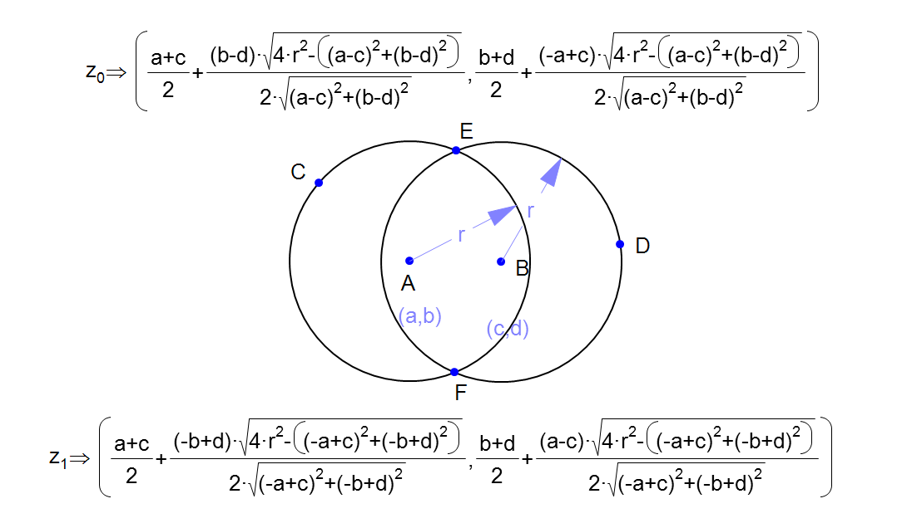

### 第189场周赛

#### P1:  在既定时间做作业的学生人数
1。 计数

#### P2: 重新排列句子中的单词
1. 分割, 处理大小写, 排序, 处理首字母
2. scala 超内存, 最后一个case 无法AC。 未解决

#### P3: 收藏清单
1. 记录每个公司被哪些人收藏过
2. 对每个清单的每个值对应的收藏集合求交集, 大小等于1,说明它不是别人的子集

#### P4: 
1. 已知两个点和半径,求圆心
2. 两两枚举点, 计算覆盖的点数求最大值
3. 最少能覆盖一个点

圆心公式:

